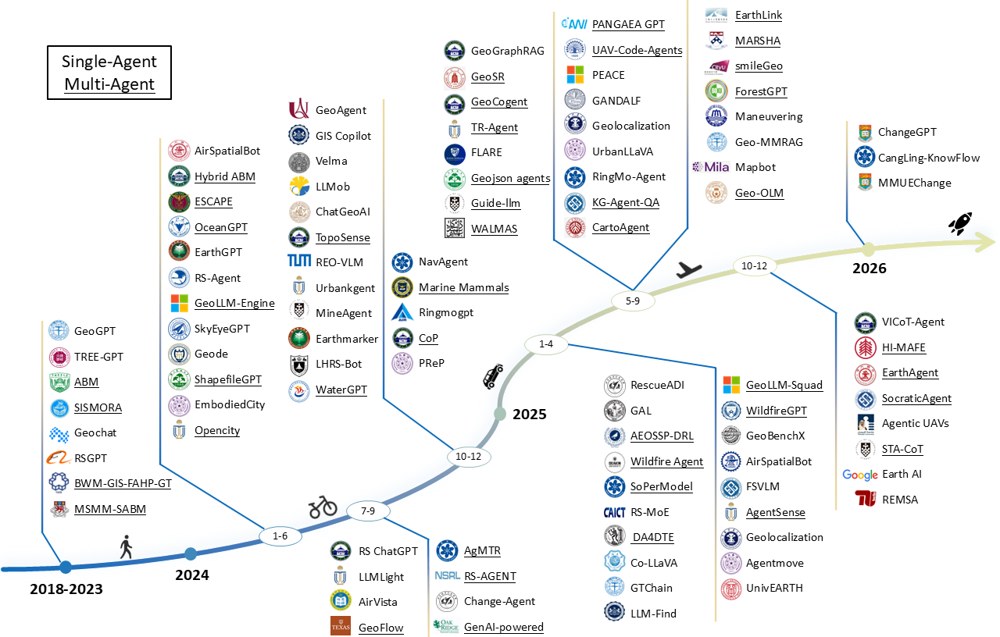

# Awesome-Remote-Sensing-Agents

<div align="center">

[](https://awesome.re)
[](https://arxiv.org/abs/xxxx.xxxxx)
[](https://opensource.org/licenses/MIT)
[](http://makeapullrequest.com)
[](https://github.com/PolyX-Research/awesome-remote-sensing-agent)
[](https://github.com/PolyX-Research/awesome-remote-sensing-agent)
[](https://github.com/PolyX-Research/awesome-remote-sensing-agent)

🛰️ **A curated collection of 100+ papers at the intersection of AI Agents and Remote Sensing** 🚀





</div>

> [!IMPORTANT]
> **We welcome community contributions to keep this list up-to-date!**
>
> - 📝 Add missing papers via [Pull Request](https://github.com/PolyX-Research/awesome-remote-sensing-agent/pulls)
> - 🏷️ Propose new or refined categories
> - 🔗 Report broken links or outdated entries
> - 💬 Reach out via [Contact](#️-contact) for any discussion

If you find this survey or repository useful in your research, please cite our paper:

```bibtex
@article{tang2025aiagent,
  title={AI Agents in Remote Sensing: A Survey},
  author={Tang, Jiaqi and Yan, Yingying and Wang, Qianzhou and Xia, Yuyang and Geng, Botong and Chen, Jianmin and Zhai, Youyang and Ma, Ke and He, Qingfeng and Shao, Weigeng and Sun, Yunjin and Dai, Junwei and Chen, Chuxi and Xu, Xiaogang and Yao, Kelu and Zhang, Lei and Wei, Wei and Chen, Qifeng and Plaza, Antonio and Zhang, Yanning},
  journal={arXiv preprint arXiv:xxx},
  year={2025}
}
```

## 🔥 News

- **[2025.12.29]** 🎉 Initial release of the survey paper and this repository.

## 📚 Contents

- [🔥 News](#-news)
- [📚 Contents](#-contents)
  - [Papers](#papers) — Ecological Monitoring · Emergency Response · Geological Exploration · Marine Supervision · Precision Agriculture · Urban Governance · Others
  - [Datasets & Benchmarks](#datasets--benchmarks)
- [🤝 How to Contribute](#-how-to-contribute)
- [✉️ Contact](#️-contact)
- [✨ Star History](#-star-history)

| Badge | Meaning |
|-------|---------|
|  | Preprint on arXiv |
|  | Published at a conference or journal |
|  | Code repository available |
|  | Application domain |
|  | Agent design category (planning, memory, tool use, etc.) |

### Papers

<details open>
<summary><strong>Ecological Monitoring</strong></summary>

<table style="width: 100%;">
  <colgroup>
    <col>
    <col style="width: auto;">
    <col style="width: auto;">
  </colgroup>
  <thead>
    <tr>
      <th>Title</th>
      <th>Application & Tags</th>
      <th>Links</th>
    </tr>
  </thead>
  <tbody>
    <tr>
      <td> <a href="https://github.com/be-chen/REMSA"></a><br>REMSA: An LLM Agent for Foundation Model Selection in Remote Sensing</td>
      <td style="white-space: nowrap;"></td>
      <td style="white-space: nowrap;"><a href="https://arxiv.org/abs/2511.17442">Paper</a><br><a href="https://github.com/be-chen/REMSA">GitHub</a></td>
    </tr>
    <tr>
      <td><br>ForestGPT and Beyond: A Trustworthy Domain-Specific Large Language Model Paving the Way to Forestry 5.0</td>
      <td style="white-space: nowrap;"></td>
      <td style="white-space: nowrap;"><a href="https://www.mdpi.com/2079-9292/14/18/3583">Paper</a></td>
    </tr>
    <tr>
      <td><br>GANDALF: A LLM-based Approach to Map Bark Beetle Outbreaks in Semantic Stories of Sentinel-2 Images</td>
      <td style="white-space: nowrap;"></td>
      <td style="white-space: nowrap;"><a href="https://dl.acm.org/doi/10.1145/3605098.3636105">Paper</a></td>
    </tr>
    <tr>
      <td><br>CLEAR: Climate Policy Retrieval and Summarization Using LLMs</td>
      <td style="white-space: nowrap;"></td>
      <td style="white-space: nowrap;"><a href="https://dl.acm.org/doi/10.1145/3701716.3715510">Paper</a></td>
    </tr>
    <tr>
      <td><br>DA4DTE: An Agentic System for Enhancing the Accessibility of Digital Twins of Earth</td>
      <td style="white-space: nowrap;"><br></td>
      <td style="white-space: nowrap;"><a href="https://ceur-ws.org/Vol-3905/">Paper</a></td>
    </tr>
    <tr>
      <td><br>EarthLink: A Self-Evolving AI Agent for Climate Science</td>
      <td style="white-space: nowrap;"><br></td>
      <td style="white-space: nowrap;"><a href="https://researchtrend.ai/papers/2507.17311">Paper</a></td>
    </tr>
    <tr>
      <td><br>A Self-Evolving AI Agent System for Climate Science</td>
      <td style="white-space: nowrap;"></td>
      <td style="white-space: nowrap;"><a href="https://arxiv.org/pdf/2507.17311">Paper</a></td>
    </tr>
    <tr>
      <td><br>Towards LLM Agents for Earth Observation</td>
      <td style="white-space: nowrap;"></td>
      <td style="white-space: nowrap;"><a href="https://arxiv.org/pdf/2504.12110">Paper</a><br><a href="https://iandrover.github.io/UnivEarth/">GitHub</a><br><a href="https://iandrover.github.io/UnivEarth/">Model</a></td>
    </tr>
    <tr>
      <td><br>Accelerating Earth Science Discovery via Multi-Agent LLM Systems</td>
      <td style="white-space: nowrap;"><br></td>
      <td style="white-space: nowrap;"><a href="https://arxiv.org/pdf/2503.05854">Paper</a></td>
    </tr>
    <tr>
      <td><br>GeoRSMLLM: A Multimodal Large Language Model for Vision-Language Tasks in Geoscience and Remote Sensing</td>
      <td style="white-space: nowrap;"></td>
      <td style="white-space: nowrap;"><a href="https://arxiv.org/abs/2503.12490">Paper</a></td>
    </tr>
    <tr>
      <td><br>CangLing-KnowFlow: A Unified Knowledge-and-Flow-fused Agent for Remote Sensing Applications</td>
      <td style="white-space: nowrap;"><br></td>
      <td style="white-space: nowrap;"><a href="https://arxiv.org/pdf/2512.15231">Paper</a></td>
    </tr>
    <tr>
      <td><br>Google Earth AI and Gemini for Climate and Environmental Analysis</td>
      <td style="white-space: nowrap;"></td>
      <td style="white-space: nowrap;"><a href="https://www.mdpi.com/2073-4433/16/5/490">Paper</a></td>
    </tr>
    <tr>
      <td><br>REO-VLM: Transforming VLM to Meet Regression Challenges in Earth Observation</td>
      <td style="white-space: nowrap;"><br></td>
      <td style="white-space: nowrap;"></td>
    </tr>
    <tr>
      <td> <a href="https://github.com/opendatalab/H2RSVLM"></a><br>H2RSVLM: Towards Helpful and Honest Remote Sensing Large Vision Language Model</td>
      <td style="white-space: nowrap;"></td>
      <td style="white-space: nowrap;"><a href="https://arxiv.org/abs/2403.20213">Paper</a><br><a href="https://github.com/opendatalab/H2RSVLM">GitHub</a></td>
    </tr>
    <tr>
      <td> <a href="https://github.com/NJU-LHRS/LHRS-Bot"></a><br>LHRS-Bot: Empowering Remote Sensing with VGI-Enhanced Large Multimodal Language Model</td>
      <td style="white-space: nowrap;"></td>
      <td style="white-space: nowrap;"><a href="https://arxiv.org/abs/2402.10549">Paper</a><br><a href="https://github.com/NJU-LHRS/LHRS-Bot">GitHub</a></td>
    </tr>
    <tr>
      <td> <a href="https://www.google.com/url?sa=E&source=gmail&q=https://github.com/BigData-KSU/RS-LLAVA&authuser=2"></a><br>RS-LLaVA: A Large Vision-Language Model for Joint Captioning and Question Answering in Remote Sensing Imagery</td>
      <td style="white-space: nowrap;"></td>
      <td style="white-space: nowrap;"><a href="https://doi.org/10.3390/rs16091477">Paper</a><br><a href="https://www.google.com/url?sa=E&source=gmail&q=https://github.com/BigData-KSU/RS-LLAVA&authuser=2">GitHub</a></td>
    </tr>
    <tr>
      <td> <a href="https://github.com/wivizhang/EarthGPT"></a><br>EarthGPT: A Universal Multimodal Large Language Model for Multisensor Image Comprehension in Remote Sensing Domain</td>
      <td style="white-space: nowrap;"></td>
      <td style="white-space: nowrap;"><a href="DOI:10.1109/TGRS.2024.3409624">Paper</a><br><a href="https://github.com/wivizhang/EarthGPT">GitHub</a></td>
    </tr>
    <tr>
      <td><br>Transfer Learning in Environmental Remote Sensing</td>
      <td style="white-space: nowrap;"></td>
      <td style="white-space: nowrap;"><a href="https://www.sciencedirect.com/science/article/pii/S0034425723004765">Paper</a></td>
    </tr>
    <tr>
      <td><br>TREE-GPT: Modular Large Language Model Expert System for Forest Remote Sensing Image Understanding and Interactive Analysis</td>
      <td style="white-space: nowrap;"><br><br></td>
      <td style="white-space: nowrap;"><a href="https://doi.org/10.5194/isprs-archives-XLVIII-1-W2-2023-1729-2023">Paper</a></td>
    </tr>
    <tr>
      <td><br>An Agent-Based Model to Represent Space-Time Propagation of Forest-Fire Smoke</td>
      <td style="white-space: nowrap;"></td>
      <td style="white-space: nowrap;"><a href="https://isprs-annals.copernicus.org/articles/IV-4/207/2018/isprs-annals-IV-4-207-2018.pdf">Paper</a></td>
    </tr>
    <tr>
      <td><br>High-Resolution Mapping of Global Surface Water and Its Long-Term Changes</td>
      <td style="white-space: nowrap;"></td>
      <td style="white-space: nowrap;"></td>
    </tr>
  </tbody>
</table>

</details>
<details open>
<summary><strong>Emergency Response</strong></summary>

<table style="width: 100%;">
  <colgroup>
    <col>
    <col style="width: auto;">
    <col style="width: auto;">
  </colgroup>
  <thead>
    <tr>
      <th>Title</th>
      <th>Application & Tags</th>
      <th>Links</th>
    </tr>
  </thead>
  <tbody>
    <tr>
      <td><br>FIRE-VLM: A Vision-Language-Driven Reinforcement Learning Framework for UAV Wildfire Tracking</td>
      <td style="white-space: nowrap;"></td>
      <td style="white-space: nowrap;"><a href="https://www.google.com/search?q=https://arxiv.org/abs/2601.03449&authuser=2">Paper</a></td>
    </tr>
    <tr>
      <td><br>UAV-CodeAgents: Scalable UAV Mission Planning via Multi-Agent ReAct and Vision-Language Reasoning</td>
      <td style="white-space: nowrap;"><br><br></td>
      <td style="white-space: nowrap;"><a href="https://arxiv.org/abs/2505.07236">Paper</a></td>
    </tr>
    <tr>
      <td><br>Geospatial Artificial Intelligence for Satellite-based Flood Extent Mapping</td>
      <td style="white-space: nowrap;"></td>
      <td style="white-space: nowrap;"><a href="https://arxiv.org/pdf/2504.02214?">Paper</a></td>
    </tr>
    <tr>
      <td> <a href="https://github.com/Xieyangxinyu/WildfireGPT"></a><br>A RAG-Based Multi-Agent LLM System for Natural Hazard Resilience and Adaptation</td>
      <td style="white-space: nowrap;"><br></td>
      <td style="white-space: nowrap;"><a href="https://arxiv.org/abs/2504.17200">Paper</a><br><a href="https://github.com/Xieyangxinyu/WildfireGPT">GitHub</a></td>
    </tr>
    <tr>
      <td> <a href="https://github.com/google-research/population-dynamics"></a><br>Earth AI: Unlocking Geospatial Insights with Foundation Models and Cross-Modal Reasoning</td>
      <td style="white-space: nowrap;"></td>
      <td style="white-space: nowrap;"><a href="https://arxiv.org/pdf/2510.18318">Paper</a><br><a href="https://github.com/google-research/population-dynamics">GitHub</a></td>
    </tr>
    <tr>
      <td><br>Empowering LLM Agents with Geospatial Awareness: Toward Grounded Reasoning for Wildfire Response</td>
      <td style="white-space: nowrap;"></td>
      <td style="white-space: nowrap;"><a href="https://arxiv.org/abs/2510.12061">Paper</a></td>
    </tr>
    <tr>
      <td><br>A Conceptual High Level Multiagent System for Wildfire Management</td>
      <td style="white-space: nowrap;"><br><br></td>
      <td style="white-space: nowrap;"><a href="https://doi.org/10.1109/TGRS.2025.3559062">Paper</a></td>
    </tr>
    <tr>
      <td><br>RescueADI: Adaptive Disaster Interpretation in Remote Sensing Images With Autonomous Agents</td>
      <td style="white-space: nowrap;"><br><br><br></td>
      <td style="white-space: nowrap;"><a href="https://doi.org/10.1109/TGRS.2025.3532594">Paper</a></td>
    </tr>
    <tr>
      <td><br>LLM-Enhanced Disaster Geolocalization Using Implicit Geoinformation from Multimodal Data: A Case Study of Hurricane Harvey</td>
      <td style="white-space: nowrap;"><br><br><br></td>
      <td style="white-space: nowrap;"><a href="https://doi.org/10.1016/j.jag.2025.104423">Paper</a></td>
    </tr>
    <tr>
      <td><br>Knowledge-Guided Large Language Models for Enhancing Agent-Based Wildfire Spatial Simulation</td>
      <td style="white-space: nowrap;"></td>
      <td style="white-space: nowrap;"><a href="https://doi.org/10.1145/3764921.3770152">Paper</a><br><a href="https://www.mrlc.gov/data?f%5B0%5D=category%3ALand%20Cover&f%5B1%5D=year%3A2024https://www.arcgis.com/home/item.html?id=0383ba18906149e3bd2a0975a0afdb8ehttps://www.ncei.noaa.gov/access/search/data-search/global-hourly?pageNum=1&startDate=2024-06-01T00:00:00&endDate=2024-06-06T23:59:59&pageSize=10&bbox=38.299,-121.573,37.478,-120.919&place=County:1389https://en.wikipedia.org/wiki/Corral_Fire_(2024)">Dataset</a></td>
    </tr>
    <tr>
      <td><br>Large-Language-Model-Driven Agents for Fire Evacuation Simulation in a Cellular Automata Environment</td>
      <td style="white-space: nowrap;"></td>
      <td style="white-space: nowrap;"><a href="https://doi.org/10.1016/j.ssci.2025.106935">Paper</a></td>
    </tr>
    <tr>
      <td><br>From Perceptions to Decisions: Wildfire Evacuation Decision Prediction with Behavioral Theory-informed LLMs</td>
      <td style="white-space: nowrap;"></td>
      <td style="white-space: nowrap;"><a href="https://aclanthology.org/2025.acl-long.1438/">Paper</a></td>
    </tr>
    <tr>
      <td><br>ESCAPE: Evacuation Simulation Using Cognitive Agent-Based Modeling on Possible Earthquake in GAMA Platform for the Case of Kalayaan Residence Hall</td>
      <td style="white-space: nowrap;"><br></td>
      <td style="white-space: nowrap;"><a href="https://isprs-archives.copernicus.org/articles/XLVIII-4-W8-2023/39/2024/">Paper</a></td>
    </tr>
    <tr>
      <td><br>Description of Wildfires Spreading and Extinguishing with the Aid of Agent-Based Models</td>
      <td style="white-space: nowrap;"></td>
      <td style="white-space: nowrap;"><a href="https://research.sfu-kras.ru/publications/publication/43305160">Paper</a></td>
    </tr>
  </tbody>
</table>

</details>
<details open>
<summary><strong>Geological Exploration</strong></summary>

<table style="width: 100%;">
  <colgroup>
    <col>
    <col style="width: auto;">
    <col style="width: auto;">
  </colgroup>
  <thead>
    <tr>
      <th>Title</th>
      <th>Application & Tags</th>
      <th>Links</th>
    </tr>
  </thead>
  <tbody>
    <tr>
      <td> <a href="https://github.com/microsoft/PEACE"></a><br>PEACE: Empowering Geologic Map Holistic Understanding with MLLMs</td>
      <td style="white-space: nowrap;"><br><br><br><br></td>
      <td style="white-space: nowrap;"><a href="https://doi.org/10.1109/CVPR52734.2025.00369">Paper</a><br><a href="https://github.com/microsoft/PEACE">GitHub</a></td>
    </tr>
    <tr>
      <td><br>STA-CoT: Structured Target-Centric Agentic Chain-of-Thought for Consistent Multi-Image Geological Reasoning</td>
      <td style="white-space: nowrap;"></td>
      <td style="white-space: nowrap;"><a href="https://aclanthology.org/2025.findings-emnlp.1386/">Paper</a><br><a href="https://data.dea.ga.gov.au/?prefix=ASTER_Geoscience_Map_of_Australia/https://map.sarig.sa.gov.au/">Dataset</a></td>
    </tr>
    <tr>
      <td> <a href="https://github.com/Yusin2Chen/GeoAgent"></a><br>Automating Geospatial Vision Tasks with a Large Language Model Agent</td>
      <td style="white-space: nowrap;"></td>
      <td style="white-space: nowrap;"><a href="https://link.springer.com/chapter/10.1007/978-3-662-72243-5_13">Paper</a><br><a href="https://github.com/Yusin2Chen/GeoAgent">GitHub</a></td>
    </tr>
    <tr>
      <td><br>A Vision-Language Foundation Model-Based Multi-Modal Retrieval-Augmented Generation Framework for Remote Sensing Lithological Recognition</td>
      <td style="white-space: nowrap;"></td>
      <td style="white-space: nowrap;"><a href="https://www.sciencedirect.com/science/article/abs/pii/S0924271625001510">Paper</a></td>
    </tr>
    <tr>
      <td><br>HI-MAFE: Hyperspectral Image Multi-Agent Deep Reinforcement Learning Feature Extraction</td>
      <td style="white-space: nowrap;"><br></td>
      <td style="white-space: nowrap;"><a href="https://doi.org/10.1109/TGRS.2025.3631865">Paper</a></td>
    </tr>
    <tr>
      <td><br>MineAgent: Towards Remote-Sensing Mineral Exploration with Multimodal Large Language Models</td>
      <td style="white-space: nowrap;"><br><br></td>
      <td style="white-space: nowrap;"><a href="https://arxiv.org/abs/2412.17339">Paper</a></td>
    </tr>
  </tbody>
</table>

</details>
<details open>
<summary><strong>Marine Supervision</strong></summary>

<table style="width: 100%;">
  <colgroup>
    <col>
    <col style="width: auto;">
    <col style="width: auto;">
  </colgroup>
  <thead>
    <tr>
      <th>Title</th>
      <th>Application & Tags</th>
      <th>Links</th>
    </tr>
  </thead>
  <tbody>
    <tr>
      <td><br>OceanAI: A Conversational Platform for Accurate, Transparent, Near-Real-Time Oceanographic Insights</td>
      <td style="white-space: nowrap;"><br><br></td>
      <td style="white-space: nowrap;"><a href="https://arxiv.org/abs/2511.01019">Paper</a></td>
    </tr>
    <tr>
      <td><br>Large Language Model-Based Decision-Making for COLREGs and the Control of Autonomous Surface Vehicles</td>
      <td style="white-space: nowrap;"><br></td>
      <td style="white-space: nowrap;"><a href="https://ieeexplore.ieee.org/document/11006099">Paper</a></td>
    </tr>
    <tr>
      <td><br>Autonomous Vehicle Maneuvering Using Vision–LLM Models for Marine Surface Vehicles</td>
      <td style="white-space: nowrap;"></td>
      <td style="white-space: nowrap;"><a href="https://www.mdpi.com/2077-1312/13/8/1553">Paper</a></td>
    </tr>
    <tr>
      <td><br>OceanGPT: A Large Language Model for Ocean Science Tasks</td>
      <td style="white-space: nowrap;"></td>
      <td style="white-space: nowrap;"><a href="https://aclanthology.org/2024.acl-long.184.pdf">Paper</a></td>
    </tr>
    <tr>
      <td><br>WaterGPT: Training a Large Language Model to Become a Hydrology Expert</td>
      <td style="white-space: nowrap;"></td>
      <td style="white-space: nowrap;"><a href="https://www.mdpi.com/2073-4441/16/21/3075">Paper</a></td>
    </tr>
  </tbody>
</table>

</details>
<details open>
<summary><strong>Precision Agriculture</strong></summary>

<table style="width: 100%;">
  <colgroup>
    <col>
    <col style="width: auto;">
    <col style="width: auto;">
  </colgroup>
  <thead>
    <tr>
      <th>Title</th>
      <th>Application & Tags</th>
      <th>Links</th>
    </tr>
  </thead>
  <tbody>
    <tr>
      <td><br>AgriGPT: A Large Language Model Ecosystem for Agriculture</td>
      <td style="white-space: nowrap;"><br><br></td>
      <td style="white-space: nowrap;"><a href="https://arxiv.org/abs/2508.08632">Paper</a></td>
    </tr>
    <tr>
      <td><br>ChatLeafDisease: A Chain-of-Thought Prompting Approach for Crop Disease Classification Using Large Language Models</td>
      <td style="white-space: nowrap;"><br></td>
      <td style="white-space: nowrap;"><a href="https://doi.org/10.34133/plantphenomics.100094">Paper</a></td>
    </tr>
    <tr>
      <td><br>RS-MoE: A Vision–Language Model With Mixture of Experts for Remote Sensing Image Captioning and Visual Question Answering</td>
      <td style="white-space: nowrap;"><br><br></td>
      <td style="white-space: nowrap;"></td>
    </tr>
    <tr>
      <td><br>Identifying Potential Rural Residential Areas for Land Consolidation Using a Data-Driven Agent-Based Model</td>
      <td style="white-space: nowrap;"><br></td>
      <td style="white-space: nowrap;"><a href="https://doi.org/10.1016/j.landusepol.2024.107260">Paper</a></td>
    </tr>
    <tr>
      <td><br>Planning to ‘Hear the Farmer’s Voice’: an Agent-Based Modelling Approach to Agricultural Land Use Planning</td>
      <td style="white-space: nowrap;"></td>
      <td style="white-space: nowrap;"><a href="https://link.springer.com/article/10.1007/s12061-023-09538-7">Paper</a></td>
    </tr>
    <tr>
      <td><br>A Framework for Data-Driven Agent-Based Modelling of Agricultural Land Use</td>
      <td style="white-space: nowrap;"></td>
      <td style="white-space: nowrap;"><a href="https://www.mdpi.com/2073-445X/12/4/756">Paper</a></td>
    </tr>
    <tr>
      <td><br>An Agent-Based Model to Simulate the Cultivation Pattern Change of Farmer Households in the North China Plain</td>
      <td style="white-space: nowrap;"><br><br></td>
      <td style="white-space: nowrap;"><a href="https://doi.org/10.5194/isprs-annals-X-3-2024-445-2024">Paper</a></td>
    </tr>
  </tbody>
</table>

</details>
<details open>
<summary><strong>Urban Governance</strong></summary>

<table style="width: 100%;">
  <colgroup>
    <col>
    <col style="width: auto;">
    <col style="width: auto;">
  </colgroup>
  <thead>
    <tr>
      <th>Title</th>
      <th>Application & Tags</th>
      <th>Links</th>
    </tr>
  </thead>
  <tbody>
    <tr>
      <td><br>MMUEChange: A generalized LLM agent framework for intelligent multi-modal urban environment change analysis</td>
      <td style="white-space: nowrap;"><br><br><br></td>
      <td style="white-space: nowrap;"><a href="https://arxiv.org/pdf/2601.05483">Paper</a></td>
    </tr>
    <tr>
      <td><br>AgentSense: LLMs Empower Generalizable and Explainable Web-Based Participatory Urban Sensing</td>
      <td style="white-space: nowrap;"></td>
      <td style="white-space: nowrap;"><a href="https://arxiv.org/abs/2510.19661">Paper</a></td>
    </tr>
    <tr>
      <td><br>SoPerModel: Leveraging Social Perception for Multi-Agent Trajectory Prediction</td>
      <td style="white-space: nowrap;"></td>
      <td style="white-space: nowrap;"><a href="https://doi.org/10.1109/TGRS.2025.3543661">Paper</a></td>
    </tr>
    <tr>
      <td> <a href="https://github.com/VisionXLab/AirSpatialBot"></a><br>AirSpatialBot: A Spatially Aware Aerial Agent for Fine-Grained Vehicle Attribute Recognition and Retrieval</td>
      <td style="white-space: nowrap;"><br><br><br></td>
      <td style="white-space: nowrap;"><a href="https://ieeexplore.ieee.org/document/11006099">Paper</a><br><a href="https://github.com/VisionXLab/AirSpatialBot">GitHub</a></td>
    </tr>
    <tr>
      <td><br>LLM Agent Framework for Intelligent Change Analysis in Urban Environment Using Remote Sensing Imagery</td>
      <td style="white-space: nowrap;"><br></td>
      <td style="white-space: nowrap;"><a href="https://doi.org/10.1016/j.autcon.2025.106341">Paper</a></td>
    </tr>
    <tr>
      <td> <a href="https://github.com/tsinghua-fib-lab/UrbanLLaVA"></a><br>UrbanLLaVA: A Multi-Modal Large Language Model for Urban Intelligence with Spatial Reasoning and Understanding</td>
      <td style="white-space: nowrap;"><br></td>
      <td style="white-space: nowrap;"><a href="https://doi.org/10.48550/arXiv.2506.23219">Paper</a><br><a href="https://github.com/tsinghua-fib-lab/UrbanLLaVA">GitHub</a></td>
    </tr>
    <tr>
      <td> <a href="https://github.com/Traffic-Alpha/TrafficAgent"></a><br>Automating Traffic Model Enhancement with AI Research Agent</td>
      <td style="white-space: nowrap;"></td>
      <td style="white-space: nowrap;"><a href="https://doi.org/10.1016/j.trc.2025.105187">Paper</a><br><a href="https://github.com/Traffic-Alpha/TrafficAgent">GitHub</a></td>
    </tr>
    <tr>
      <td><br>Roads: Robust Prompt-Driven Multi-Class Anomaly Detection Under Domain Shift</td>
      <td style="white-space: nowrap;"></td>
      <td style="white-space: nowrap;"></td>
    </tr>
    <tr>
      <td><br>A Spatiotemporal–Semantic Coupling Intelligent Q&A Method for Land Use Approval Based on Knowledge Graphs and Intelligent Agents</td>
      <td style="white-space: nowrap;"><br></td>
      <td style="white-space: nowrap;"><a href="https://www.mdpi.com/2076-3417/15/16/9012">Paper</a></td>
    </tr>
    <tr>
      <td><br>NavAgent: Multi-scale Urban Street View Fusion For UAV Embodied Vision-and-Language Navigation</td>
      <td style="white-space: nowrap;"><br></td>
      <td style="white-space: nowrap;"><a href="https://arxiv.org/abs/2411.08579">Paper</a></td>
    </tr>
    <tr>
      <td><br>GenAI-Powered Multi-Agent Paradigm for Smart Urban Mobility: Opportunities and Challenges for Integrating Large Language Models (LLMs) and Retrieval-Augmented Generation (RAG) with Intelligent Transportation Systems</td>
      <td style="white-space: nowrap;"></td>
      <td style="white-space: nowrap;"><a href="https://arxiv.org/abs/2409.00494">Paper</a></td>
    </tr>
    <tr>
      <td><br>AgentMove: Predicting Human Mobility Anywhere Using Large Language Model Based Agentic Framework</td>
      <td style="white-space: nowrap;"></td>
      <td style="white-space: nowrap;"><a href="https://arxiv.org/abs/2408.13986">Paper</a></td>
    </tr>
    <tr>
      <td><br>Perceive, Reflect, and Plan: Designing LLM Agent for Goal-Directed City Navigation Without Instructions</td>
      <td style="white-space: nowrap;"></td>
      <td style="white-space: nowrap;"><a href="https://arxiv.org/abs/2408.04168">Paper</a></td>
    </tr>
    <tr>
      <td> <a href="https://github.com/usail-hkust/UrbanKGent"></a><br>UrbanKGent: A Unified Large Language Model Agent Framework for Urban Knowledge Graph Construction</td>
      <td style="white-space: nowrap;"></td>
      <td style="white-space: nowrap;"><a href="https://arxiv.org/abs/2402.06861">Paper</a><br><a href="https://github.com/usail-hkust/UrbanKGent">GitHub</a></td>
    </tr>
    <tr>
      <td><br>Large Language Models as Urban Residents: An LLM Agent Framework for Personal Mobility Generation</td>
      <td style="white-space: nowrap;"></td>
      <td style="white-space: nowrap;"><a href="https://arxiv.org/abs/2402.14744">Paper</a></td>
    </tr>
    <tr>
      <td><br>Guide-LLM: An Embodied LLM Agent and Text-Based Topological Map for Robotic Guidance of People with Visual Impairments</td>
      <td style="white-space: nowrap;"></td>
      <td style="white-space: nowrap;"><a href="https://arxiv.org/abs/2410.20666">Paper</a></td>
    </tr>
    <tr>
      <td> <a href="https://github.com/tsinghua-fib-lab/Anonymous-OpenCity"></a><br>OpenCity: A Scalable Platform to Simulate Urban Activities with Massive LLM Agents</td>
      <td style="white-space: nowrap;"></td>
      <td style="white-space: nowrap;"><a href="https://arxiv.org/abs/2410.21286">Paper</a><br><a href="https://github.com/tsinghua-fib-lab/Anonymous-OpenCity">GitHub</a></td>
    </tr>
    <tr>
      <td><br>TopoSense: Agent-Driven Topological Graph Extraction from Remote Sensing Image</td>
      <td style="white-space: nowrap;"></td>
      <td style="white-space: nowrap;"><a href="https://doi.org/10.5194/isprs-annals-X-3-2024-445-2024">Paper</a></td>
    </tr>
    <tr>
      <td> <a href="https://github.com/mbzuai-oryx/geochat"></a><br>GeoChat: Grounded Large Vision-Language Model for Remote Sensing</td>
      <td style="white-space: nowrap;"></td>
      <td style="white-space: nowrap;"><a href="https://doi.org/10.1109/CVPR52733.2024.02629">Paper</a><br><a href="https://github.com/mbzuai-oryx/geochat">GitHub</a></td>
    </tr>
    <tr>
      <td> <a href="https://github.com/Chunmian-art/City-3DQA?tab=readme-ov-file"></a><br>3D Question Answering for City Scene Understanding</td>
      <td style="white-space: nowrap;"><br></td>
      <td style="white-space: nowrap;"><a href="https://dl.acm.org/doi/abs/10.1145/3664647.3681022">Paper</a><br><a href="https://github.com/Chunmian-art/City-3DQA?tab=readme-ov-file">GitHub</a><br><a href="https://github.com/Chunmian-art/City-3DQA?tab=readme-ov-file">Dataset</a></td>
    </tr>
    <tr>
      <td> <a href="https://github.com/raphael-sch/VELMA"></a><br>VELMA: Verbalization Embodiment of LLM Agents for Vision and Language Navigation in Street View</td>
      <td style="white-space: nowrap;"></td>
      <td style="white-space: nowrap;"><a href="https://arxiv.org/abs/2307.06082">Paper</a><br><a href="https://github.com/raphael-sch/VELMA">GitHub</a></td>
    </tr>
    <tr>
      <td><br>EmbodiedCity: Embodied Aerial Agent for City-Level Visual Language Navigation Using Large Language Model</td>
      <td style="white-space: nowrap;"></td>
      <td style="white-space: nowrap;"><a href="https://arxiv.org/pdf/2410.09604">Paper</a></td>
    </tr>
    <tr>
      <td><br>AirVista: Empowering UAVs With 3D Spatial Reasoning Abilities Through A Multimodal Large Language Model Agent</td>
      <td style="white-space: nowrap;"><br></td>
      <td style="white-space: nowrap;"><a href="https://doi.org/10.1109/ITSC58415.2024.10919532">Paper</a></td>
    </tr>
    <tr>
      <td><br>LLMLight: Large Language Models as Traffic Signal Control Agents</td>
      <td style="white-space: nowrap;"></td>
      <td style="white-space: nowrap;"><a href="https://arxiv.org/abs/2312.16044">Paper</a></td>
    </tr>
    <tr>
      <td><br>GeoGPT: Understanding and Processing Geospatial Tasks through An Autonomous GPT</td>
      <td style="white-space: nowrap;"><br><br></td>
      <td style="white-space: nowrap;"><a href="https://doi.org/10.48550/arXiv.2307.07930">Paper</a></td>
    </tr>
    <tr>
      <td><br>Optimum landfill site selection by a hybrid multi-criteria and multi-Agent decision-making method in a temperate and humid climate: BWM-GIS-FAHP-GT</td>
      <td style="white-space: nowrap;"></td>
      <td style="white-space: nowrap;"><a href="https://doi.org/10.1016/j.scs.2021.103641">Paper</a><br><a href="none">GitHub</a></td>
    </tr>
    <tr>
      <td><br>Urban Change Detection for Multispectral Earth Observation Using Convolutional Neural Networks</td>
      <td style="white-space: nowrap;"></td>
      <td style="white-space: nowrap;"></td>
    </tr>
  </tbody>
</table>

</details>
<details open>
<summary><strong>Others</strong></summary>

<table style="width: 100%;">
  <colgroup>
    <col>
    <col style="width: auto;">
    <col style="width: auto;">
  </colgroup>
  <thead>
    <tr>
      <th>Title</th>
      <th>Application & Tags</th>
      <th>Links</th>
    </tr>
  </thead>
  <tbody>
    <tr>
      <td><br>VICoT-Agent: A Vision-Interleaved Chain-of-Thought Framework for Interpretable Multimodal Reasoning and Scalable Remote Sensing Analysis</td>
      <td style="white-space: nowrap;"></td>
      <td style="white-space: nowrap;"><a href="https://arxiv.org/abs/2511.20085">Paper</a></td>
    </tr>
    <tr>
      <td><br>Designing Domain-Specific Agents via Hierarchical Task Abstraction Mechanism</td>
      <td style="white-space: nowrap;"><br></td>
      <td style="white-space: nowrap;"><a href="https://arxiv.org/abs/2511.17198">Paper</a><br><a href="https://earth-insights.github.io/EarthAgent">GitHub</a></td>
    </tr>
    <tr>
      <td> <a href="https://github.com/dstamoulis/geo-olms"></a><br>GeoFlow: Agentic Workflow Automation for Geospatial Tasks</td>
      <td style="white-space: nowrap;"></td>
      <td style="white-space: nowrap;"><a href="https://arxiv.org/abs/2508.04719">Paper</a><br><a href="https://github.com/dstamoulis/geo-olms">GitHub</a><br><a href="https://arxiv.org/abs/2404.15500">Dataset</a></td>
    </tr>
    <tr>
      <td><br>RingMo-Agent: A Unified Remote Sensing Foundation Model for Multi-Platform and Multi-Modal Reasoning</td>
      <td style="white-space: nowrap;"></td>
      <td style="white-space: nowrap;"><a href="https://doi.org/10.48550/arXiv.2507.20776">Paper</a></td>
    </tr>
    <tr>
      <td><br>An energy-efficient learning solution for the Agile Earth Observation Satellite Scheduling Problem</td>
      <td style="white-space: nowrap;"></td>
      <td style="white-space: nowrap;"><a href="https://arxiv.org/abs/2503.04803">Paper</a></td>
    </tr>
    <tr>
      <td><br>Multi-Agent Geospatial Copilots for Remote Sensing Workflows</td>
      <td style="white-space: nowrap;"><br><br></td>
      <td style="white-space: nowrap;"><a href="https://doi.org/10.48550/arXiv.2501.16254">Paper</a></td>
    </tr>
    <tr>
      <td> <a href="https://github.com/demo1shining/Co-LLaVA"></a><br>Co-LLaVA: Efficient Remote Sensing Visual Question Answering via Model Collaboration</td>
      <td style="white-space: nowrap;"></td>
      <td style="white-space: nowrap;"><a href="https://doi.org/10.3390/rs17030466">Paper</a><br><a href="https://github.com/demo1shining/Co-LLaVA">GitHub</a></td>
    </tr>
    <tr>
      <td><br>GIS Copilot: Towards an Autonomous GIS Agent for Spatial Analysis</td>
      <td style="white-space: nowrap;"><br></td>
      <td style="white-space: nowrap;"><a href="https://doi.org/10.1080/17538947.2025.2497489">Paper</a><br><a href="https://shorturl.at/vRcm6">GitHub</a><br><a href="https://shorturl.at/bI4Ep">Dataset</a></td>
    </tr>
    <tr>
      <td><br>Swarm Intelligence in Geo-Localization: A Multi-Agent Large Vision-Language Model Collaborative Framework</td>
      <td style="white-space: nowrap;"></td>
      <td style="white-space: nowrap;"><a href="https://arxiv.org/abs/2408.11312">Paper</a></td>
    </tr>
    <tr>
      <td><br>Chain-of-Programming (CoP): Empowering Large Language Models for Geospatial Code Generation Task</td>
      <td style="white-space: nowrap;"><br></td>
      <td style="white-space: nowrap;"><a href="https://arxiv.org/pdf/2411.10753">Paper</a></td>
    </tr>
    <tr>
      <td> <a href="https://github.com/IntelliSensing/RS-Agent"></a><br>RS-Agent: Automating Remote Sensing Tasks through Intelligent Agent</td>
      <td style="white-space: nowrap;"><br><br></td>
      <td style="white-space: nowrap;"><a href="https://doi.org/10.48550/arXiv.2406.07089">Paper</a><br><a href="https://github.com/IntelliSensing/RS-Agent">GitHub</a></td>
    </tr>
    <tr>
      <td> <a href="https://github.com/Chen-Yang-Liu/Change-Agent"></a><br>Change-Agent: Towards Interactive Comprehensive Remote Sensing Change Interpretation and Analysis</td>
      <td style="white-space: nowrap;"><br><br><br></td>
      <td style="white-space: nowrap;"><a href="https://ieeexplore.ieee.org/document/10591792">Paper</a><br><a href="https://github.com/Chen-Yang-Liu/Change-Agent">GitHub</a></td>
    </tr>
    <tr>
      <td> <a href="https://github.com/HaonanGuo/Remote-Sensing-ChatGPT"></a><br>Remote Sensing ChatGPT: Solving Remote Sensing Tasks with ChatGPT and Visual Models</td>
      <td style="white-space: nowrap;"><br></td>
      <td style="white-space: nowrap;"><a href="https://ieeexplore.ieee.org/document/10640736">Paper</a><br><a href="https://github.com/HaonanGuo/Remote-Sensing-ChatGPT">GitHub</a></td>
    </tr>
    <tr>
      <td><br>GeoLLM-Engine: A Realistic Environment for Building Geospatial Copilots</td>
      <td style="white-space: nowrap;"></td>
      <td style="white-space: nowrap;"><a href="https://doi.org/10.1109/CVPRW63382.2024.00063">Paper</a></td>
    </tr>
  </tbody>
</table>

</details>

### Datasets & Benchmarks

Training and evaluating remote sensing agents requires resources that go beyond static image-label pairs. Agents must integrate visual perception with reasoning, planning, and tool execution. We organize datasets and benchmarks into three tiers: **Perception**, **Reasoning**, and **Decision-Making**.

<details open>
<summary><strong>Datasets</strong></summary>

| Category | Name | Size | Description |
|----------|------|------|-------------|
| **Perception** | [UC Merced Land Use](https://faculty.ucmerced.edu/snewsam/papers/Yang_ACMGIS10_BagOfVisualWords.pdf) | 2.1K images | Land-use classification |
| | [AID](https://captain-whu.github.io/AID/) | 10K images | Standard scene classification |
| | [xView](https://arxiv.org/pdf/1802.07856) | ~1M instances | Object detection in overhead imagery |
| | [DOTA](https://captain-whu.github.io/DOTA) | 188K instances | Oriented object detection |
| | [iSAID](https://github.com/CAPTAIN-WHU/iSAID_Devkit) | 655K instances | Instance segmentation |
| | [xBD](https://xview2.org/) | 850K instances | Building damage assessment |
| | [EuroSAT](https://github.com/MJAHMADEE/Eurosat_DeepLearning) | 27K images | Land use/land cover classification |
| | [LEVIR-CD](https://justchenhao.github.io/LEVIR/) | 31K instances | Building change detection |
| | [Topo-boundary](https://doi.org/10.5194/isprs-annals-X-3-2024-445-2024) | 25K images | Road topology extraction |
| | [STAR](https://ieeexplore.ieee.org/document/10770756) | 210K instances | Scene graph generation |
| | [SSGD](https://gitee.com/tangjiayitangjiayi/sg-ssr) | 3.1K instances | Spatial scene graph retrieval |
| | [GID](https://doi.org/10.1016/j.rse.2019.111322) | 150 images | Land-cover classification (GF-2) |
| | [FBP](https://doi.org/10.1016/j.isprsjprs.2023.04.008) | 5B pixels | Country-scale semantic segmentation |
| | [WUSU](https://doi.org/10.1007/s11432-023-3954-4) | 68K instances | Urban semantic understanding |
| | [RealScene-ISTD](https://arxiv.org/abs/2411.11202) | 739 images | Infrared UAV small-target detection |
| **Reasoning** | [ETH/UCY & nuScenes](https://arxiv.org/abs/2502.15851) | 9K+1.4M | Trajectory prediction |
| | [AirSpatial](https://github.com/VisionXLab/AirSpatialBot) | 206K instructions | Embodied spatial reasoning |
| | [LEVIR-MCI](https://github.com/Lavender105/RSGPT) | 10K pairs | Semantic change understanding |
| | [GeoChat](https://arxiv.org/abs/2309.15372) | 318K instances | Multimodal instruction following |
| | [SkyEye-968k](https://arxiv.org/abs/2401.09712) | 968K samples | Multi-task instruction tuning |
| | [RSICap](https://github.com/Lavender105/RSGPT) | 2.6K pairs | High-precision vision-language alignment |
| | [UData](https://github.com/tsinghua-fib-lab/UrbanLLaVA) | 353K instances | Cross-modal urban reasoning |
| | [EarthVQA](https://arxiv.org/abs/2312.12222) | 208K QA pairs | Relational VQA |
| | [RS-VL3M](https://doi.org/10.48550/arXiv.2507.20776) | 3M pairs | Vision-language pretraining |
| **Decision-Making** | [RS-Agent](https://github.com/IntelliSensing/RS-Agent) | 18 tasks | Expert-guided tool invocation |
| | [RescueADI](https://arxiv.org/abs/2410.13384) | 13.4K interactions | Adaptive disaster response |
| | [AEOS-Bench](https://github.com/buaa-colalab/AEOSBench) | 16.4K scenarios | Constellation scheduling |

</details>

<details open>
<summary><strong>Benchmarks</strong></summary>

| Category | Name | Feature | Scale |
|----------|------|---------|-------|
| **Perception** | [AgMTR](https://github.com/HanboBizl/AgMTR) | Few-shot segmentation | 5 test classes |
| | [TopoSense](https://doi.org/10.5194/isprs-annals-X-3-2024-445-2024) | Graph extraction | 2,685 images |
| | [TREE-GPT](https://doi.org/10.5194/isprs-archives-XLVIII-1-W2-2023-1729-2023) | Interactive forest RS | 3 tiles |
| | [STAR](https://ieeexplore.ieee.org/document/10770756) | Scene graph generation | 1,273 images |
| | [Univ-1652](https://arxiv.org/abs/2002.12186) | Geo-localization | 1,652 buildings |
| | [SSGD](https://gitee.com/tangjiayitangjiayi/sg-ssr) | Relationship retrieval | 3,130 samples |
| | [EarthView](https://arxiv.org/pdf/2501.08111) | Large-scale pretraining | 15 terapixels |
| **Reasoning** | [AirSpatial-Bench](https://github.com/VisionXLab/AirSpatialBot) | Spatial retrieval tasks | 1,773 pairs |
| | [RSVQA](https://github.com/kaaydin/vqa-remote-sensing) | Remote sensing QA | 77K–1M questions |
| | [XLRS-Bench](https://github.com/AI9Stars/XLRS-Bench) | Ultra-high-res reasoning | 45,942 questions |
| | [RescueADI](https://arxiv.org/abs/2410.13384) | Disaster interpretation | 998 tasks |
| | [RSICap](https://github.com/Lavender105/RSGPT) | Image description | 936 QA pairs |
| | [UrbanLLaVA](https://github.com/tsinghua-fib-lab/UrbanLLaVA) | Spatial reasoning | — |
| | [EarthVQA](https://arxiv.org/abs/2312.12222) | Relational VQA | 1,809 images |
| | [City-3DQA](https://arxiv.org/abs/2407.17398) | 3D city understanding | 61K pairs |
| **Decision-Making** | [AEOS-Bench](https://github.com/buaa-colalab/AEOSBench) | Constellation scheduling | 16,410 scenarios |
| | [ThinkGeo](https://github.com/mbzuai-oryx/ThinkGeo) | Tool-augmented tasks | 486 tasks (1,773 steps) |
| | [RoadMind](https://arxiv.org/abs/2509.19354) | Disaster response | 3 cities |
| | [RS-Agent](https://github.com/IntelliSensing/RS-Agent) | Intent disambiguation & tool use | 18 tasks |
| | [GeoBenchX](https://github.com/Solirinai/GeoBenchX) | Geospatial reasoning & execution | 202 tasks |
| | [ShapefileGPT](https://arxiv.org/abs/2410.12376) | Geospatial workflow orchestration | 42 tasks |
| | [GIS Copilot](https://github.com/Teakinboyewa/SpatialAnalysisAgent) | Agent-assisted GIS decisions | 110 tasks |

</details>


## 🤝 How to Contribute

We encourage pull requests! Please follow the existing format, maintain chronological order within each category, and include paper/code links where available. You can also [contact us](#️-contact) directly.


## 📄 License

This project is released under the [MIT License](LICENSE).


## 🙏 Acknowledgments

The structure and style of this repository draw inspiration from several excellent awesome-lists, including [Awesome-Efficient-Reasoning-Models](https://github.com/fscdc/Awesome-Efficient-Reasoning-Models), [Awesome-Efficient-LLM](https://github.com/horseee/Awesome-Efficient-LLM/), and [Awesome-Context-Engineering](https://github.com/Meirtz/Awesome-Context-Engineering). We thank the open-source community for making collaborative curation possible.

## ✉️ Contact

Questions, suggestions, or collaboration ideas are always welcome!

✉️ Email: [jtang092@connect.ust.hk](mailto:jtang092@connect.ust.hk)

## ✨ Star History

[](https://www.star-history.com/#PolyX-Research/awesome-remote-sensing-agent&type=date&legend=top-left)

[**⬆ Back to top**](#awesome-ai-agent-in-remote-sensing)
